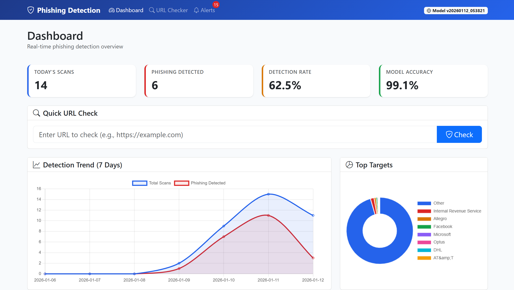
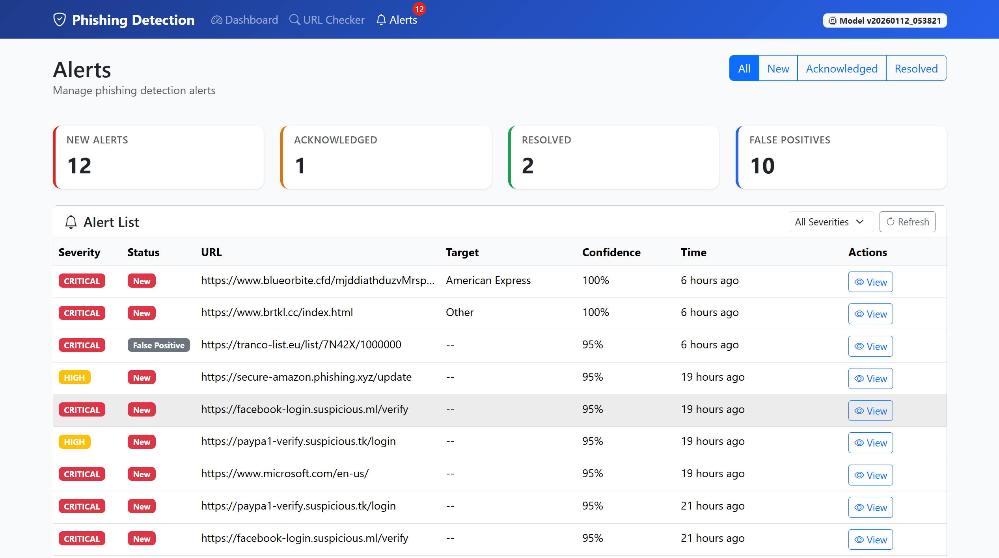
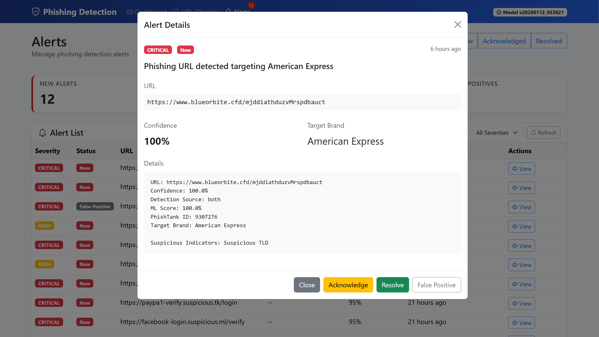

# phish-guard

Real-time phishing URL detection system using Machine Learning and PhishTank database verification.


## Screenshots

### Dashboard


### Alerts


### Alert Detail


## Overview

PhishGuard is a machine learning-powered phishing detection system that analyzes URLs in real-time to identify potential phishing attempts. It combines a trained Random Forest classifier with PhishTank database lookups to provide accurate threat detection.

### Key Features

- **ML-Powered Detection**: Random Forest model trained on 20,000+ URLs with 99% accuracy
- **60 URL Features**: Comprehensive feature extraction including entropy, domain analysis, and suspicious patterns
- **Real-time API**: FastAPI-based REST API for instant URL verification
- **Web Dashboard**: Interactive Bootstrap 5 dashboard with statistics and alerts
- **PhishTank Integration**: Cross-references URLs against known phishing database
- **Alert System**: Automatic alert generation with severity levels

## Data Sources

### Phishing URLs - PhishTank

[PhishTank](https://www.phishtank.com/) is a collaborative clearing house for phishing data. It provides a free, community-driven database of verified phishing URLs.

- **Dataset**: `verified_online.csv`
- **Size**: 46,000+ verified phishing URLs
- **Fields**: phish_id, url, submission_time, verification_time, target (brand being impersonated)
- **Top Targets**: IRS, Facebook, Microsoft, DHL, Amazon, PayPal, Netflix

### Legitimate URLs - Tranco List

[Tranco](https://tranco-list.eu/) is a research-grade top websites ranking that combines multiple popularity lists (Alexa, Cisco Umbrella, Majestic) to create a more reliable ranking.

- **Dataset**: [Tranco List 7N42X](https://tranco-list.eu/list/7N42X/1000000)
- **Size**: 1,000,000 top domains
- **Source**: Combined ranking from multiple sources
- **Usage**: Top 5,000 domains used for legitimate URL training

### Training Data Balance

| Class | Samples | Percentage |
|-------|---------|------------|
| Phishing | 10,000 | 50% |
| Legitimate | 10,000 | 50% |
| **Total** | **20,000** | **100%** |

## Model Performance

| Metric | Score |
|--------|-------|
| Accuracy | 99.08% |
| Precision | 99.55% |
| Recall | 98.60% |
| F1 Score | 99.07% |
| AUC-ROC | 99.78% |

### Top Features (by importance)

1. `url_length` - Total URL length
2. `url_entropy` - Shannon entropy of URL
3. `path_entropy` - Shannon entropy of path
4. `subdomain_length` - Length of subdomain
5. `path_length` - Length of URL path
6. `num_digits` - Count of digits in URL
7. `has_suspicious_path` - Contains login/verify/account keywords
8. `num_subdomains` - Number of subdomain levels
9. `is_suspicious_tld` - Uses suspicious TLD (.tk, .ml, etc.)

## Installation

### Prerequisites

- Python 3.11+
- pip

### Setup

```bash
# Clone the repository
git clone https://github.com/zawster/phish-guard.git
cd phish-guard

# Install dependencies
pip install -r requirements.txt

# Train the model (required first time)
python scripts/train_model.py

# Start the server
uvicorn src.api.app:app --reload --host 127.0.0.1 --port 8000
```

## Usage

### Web Dashboard

Open http://127.0.0.1:8000 in your browser to access:
- **Dashboard**: Real-time statistics and charts
- **URL Checker**: Interactive URL analysis tool
- **Alerts**: Manage phishing detection alerts

### REST API

#### Check a URL

```bash
curl -X POST http://127.0.0.1:8000/api/v1/detect \
  -H "Content-Type: application/json" \
  -d '{"url": "https://example.com"}'
```

**Response:**
```json
{
  "url": "https://example.com",
  "is_phishing": false,
  "confidence": 0.95,
  "ml_score": 0.05,
  "phishtank_match": false,
  "detection_source": "ml",
  "features": { ... }
}
```

#### API Endpoints

| Method | Endpoint | Description |
|--------|----------|-------------|
| POST | `/api/v1/detect` | Check single URL |
| POST | `/api/v1/detect/batch` | Check multiple URLs (max 100) |
| GET | `/api/v1/detect/history` | Get check history |
| GET | `/api/v1/alerts` | List all alerts |
| PATCH | `/api/v1/alerts/{id}` | Update alert status |
| GET | `/api/v1/stats/dashboard` | Dashboard statistics |
| GET | `/api/v1/stats/daily` | Daily detection trend |
| GET | `/health` | Health check |

## Project Structure

```
phish-guard/
├── config/
│   └── settings.py              # Configuration settings
├── data/
│   ├── raw/                     # Raw data files
│   ├── processed/               # Processed datasets
│   └── models/                  # Trained ML models
├── src/
│   ├── api/
│   │   ├── app.py               # FastAPI application
│   │   └── routes/              # API endpoints
│   ├── database/
│   │   ├── models.py            # SQLAlchemy models
│   │   └── repository.py        # Database operations
│   ├── ml/
│   │   ├── feature_extractor.py # URL feature extraction
│   │   └── model.py             # ML model training/prediction
│   └── services/
│       ├── detection_service.py # Main detection logic
│       └── alert_service.py     # Alert management
├── web/
│   ├── static/                  # CSS, JavaScript
│   └── templates/               # HTML templates
├── scripts/
│   └── train_model.py           # Model training script
├── verified_online.csv          # PhishTank phishing data
├── tranco_7N42X.csv             # Tranco legitimate domains
├── requirements.txt
└── README.md
```

## Feature Extraction

The model extracts 60 features from each URL:

### Length Features
- URL length, domain length, path length, query length, subdomain length

### Count Features
- Dots, hyphens, slashes, digits, special characters (@, ?, =, &)

### Domain Analysis
- Number of subdomains, TLD type, IP address detection, HTTPS usage

### Suspicious Patterns
- Brand names in wrong places, suspicious keywords (login, verify, account)
- Suspicious TLDs (.tk, .ml, .xyz), URL shorteners, punycode

### Entropy
- Shannon entropy of domain, path, and full URL (randomness detection)

## Detection Logic

```
1. Extract 60 features from URL
2. ML model predicts phishing probability (0.0 - 1.0)
3. Check URL against PhishTank database
4. Combine results:
   - PhishTank match → 100% confidence (definite phishing)
   - ML score > 0.5 → Flagged as phishing
   - ML score < 0.5 → Considered safe
5. Generate alert if phishing detected
6. Store result in database
```

## Tech Stack

| Component | Technology |
|-----------|------------|
| Backend | FastAPI, Uvicorn |
| Database | SQLite, SQLAlchemy |
| ML | scikit-learn (Random Forest) |
| Frontend | Jinja2, Bootstrap 5, Chart.js |
| Data Processing | pandas, numpy |
| URL Parsing | tldextract |

## Configuration

Environment variables (optional):

```bash
# .env file
DEBUG=true
API_HOST=0.0.0.0
API_PORT=8000
MODEL_THRESHOLD=0.5
```

## Contributing

1. Fork the repository
2. Create a feature branch (`git checkout -b feature/amazing-feature`)
3. Commit your changes (`git commit -m 'Add amazing feature'`)
4. Push to the branch (`git push origin feature/amazing-feature`)
5. Open a Pull Request

## Acknowledgments

- [PhishTank](https://www.phishtank.com/) - Phishing URL database
- [Tranco List](https://tranco-list.eu/) - Top websites ranking
- [Claude Code](https://claude.ai/claude-code) with Opus 4.5 - AI-assisted development for interface design and API structure

## Disclaimer

This tool is for educational and research purposes. While it achieves high accuracy, no phishing detection system is 100% accurate. Always exercise caution when clicking links and verify suspicious URLs through multiple sources.
